






# 👨‍🎓 教育与实习经历

- 本科(2016-2020)就读于中国农业大学理科试验班(信息科学)，研究生(2020--)就读于华中农业大学信息学院.
- 硕士期间（2020-2022）在[武玲娟教授](https://ieeexplore.ieee.org/author/37087467264)的指导下研究**可解释鲁棒机器学习**算法设计以及在**硬件安全领域**的应用.
- 博士期间（2022年转博后-至今）在[陈洪教授](https://chenhongml.github.io/)的指导下研究**可解释鲁棒优化算法设计**与**算法统计理论分析**.
- 2024年前往[中山大学](https://scst.sysu.edu.cn/members/members01/1415116.htm)交流学习， 专注于**LLM多智能体高效协作**。
- 2025年前往滴滴出行 [AI-Lab](https://www.didiglobal.com/science/ailabs) 交流实习， 关注**出行类LLM微调优化**与**智能体Benchmark构建**。
- 预计于2026年中旬毕业.

# 🔬 研究方向

我的研究方向主要包括：

- 可解释/鲁棒的机器学习算法设计（**双层优化**、**图像检测分割**、**LLM 智能体设计**、**LLM能力评估与增强**）

- 传统算法与大模型的统计性质分析（收敛、**泛化**、一致性、**可控性**保障）

- 机器学习算法应用（基于 自然语言与电路拓扑结构 等策略的**硬件安全检测**）

推荐阅读论文：[可解释人工智能（XAI）](https://arxiv.org/abs/2103.11251), [鲁棒机器学习(Robustness)](https://ieeexplore.ieee.org/document/10571602), [大语言模型综述](https://llmbook-zh.github.io/), [大模型入门手册](https://v11enp9ok1h.feishu.cn/wiki/NHZqwdWDfiAiUkkxen0csABTn9e).

如果对我的研究方向感兴趣, 或者有推荐的 **秋招Offer** 😃, 烦请联系: xlinml@163.com （万分感谢 ‼️）

# 🔥 新闻

- *2025.07 - Now*: &nbsp;🎉🎉   前往[**北京滴滴出行 AI-Labs (L-Lab) 交流实习**](https://www.didiglobal.com/science/ailabs).

- *2025.11*: &nbsp;🎉🎉  荣获华中农业大学研究生年会（数学）一等奖与“三好研究生”.

- *2025.10*: &nbsp;🎉🎉  两篇论文（“可解释/鲁棒机器学习”）被[**ICPADS**](http://ieee-icpads.org.cn/)(**分布式领域CCF-C类**会议)接收.

- *2025.08*: &nbsp;🎉🎉  一篇论文（“可解释机器学习”）被[**CIKM**](https://cikm2025.org/)(**数据挖掘领域CCF-B类**会议)接收.

- *2025.05*: &nbsp;🎉🎉  一篇论文（“大模型预训练与泛化”）被[**ICML**](https://icml.cc/)(**人工智能领域CCF-A类**会议)接收. 

- *2025.04*: &nbsp;🎉🎉  荣获 湖北省工业与应用数学学会[**优秀研究生论文**](https://aisle.hzau.edu.cn/info/1097/2476.htm). 

- *2025.01*: &nbsp;🎉🎉  一篇论文（“可解释算法与硬件安全”）被[**TCAD**](https://ieeexplore.ieee.org/document/10833822)(**体系结构领域CCF-A类**期刊)接收. 

- *2024.12*: &nbsp;🎉🎉  参加[**CCF武汉2024年会暨第八届优秀博士论坛**](https://www.ccf.org.cn/Member_Activities/2024-12-23/836271.shtml)并作口头汇报.

- *2024.11*: &nbsp;🎉🎉  荣获 [**博士国家奖学金**](https://coi.hzau.edu.cn/info/1371/15671.htm).

- *2024.06 - 2025.01:* &nbsp;🎉🎉   前往[**中山大学-沈力教授团队交流学习**](https://scst.sysu.edu.cn/teacher/ShenLi).

# 📝 机器学习方向论文

[18] ICPADS 2025 [ccf-C, Core B]
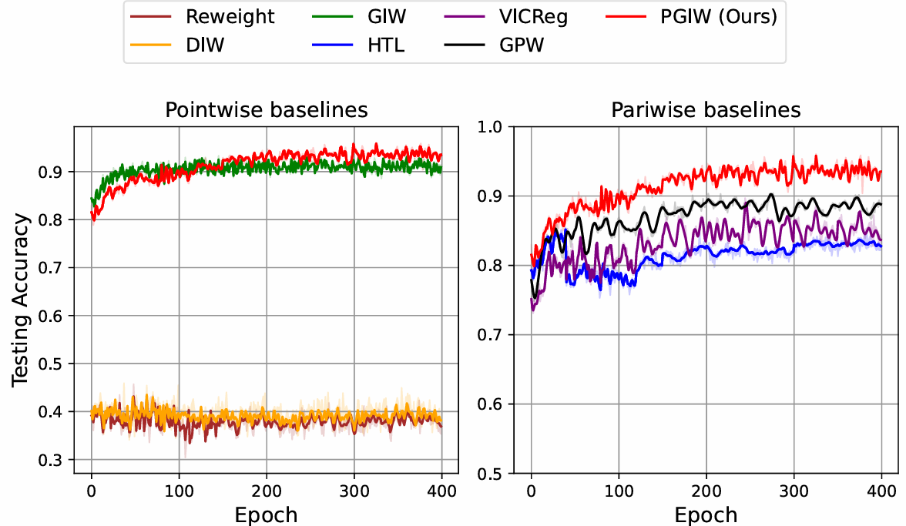

[Pairwise Generalized Importance Weighting for Metric Learning under Distribution Shift](https://zhangxuelincode.github.io/)

Richeng Zhou, **Xuelin Zhang***, Hong Chen, Weifu Li, Liyuan Liu.

**IEEE International Conference on Parallel and Distributed Systems 2025 [C]**

- PGIW框架在度量学习领域引入了一种创新的解决方案，有效地解决了传统方法在分布变化下的性能下降问题。
- 从理论角度，分析了现有算法的缺陷，证明了PGIW方法在更多的分布漂移类型下表现出风险一致性，为其实际应用提供了有力的理论支持。

[17] ICPADS 2025 [ccf-C, Core B]
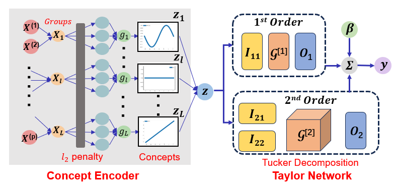

[Interpretable Bilevel Additive Taylor Model for Datasets with Noisy Labels and Imbalanced Classes](https://zhangxuelincode.github.io/)

Wenxing Zhou, Chao Xu, Lian Peng, **Xuelin Zhang***.

**IEEE International Conference on Parallel and Distributed Systems 2025 [C]**

- 利用泰勒级数展开来捕捉更高阶的相互作用，为低秩近似引入了Tucker分解。
- 结合了双层优化和稀疏神经加性建模，并集成了Tucker分解，有效地解决了标签噪声和类别不平衡，同时保持了可解释性。

[16] 华中农业大学学报 2025 [Q2, T2]
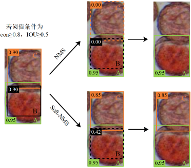

[Citrus Pollen Viability Detection via Modified YOLOv11-FS Model](https://zhangxuelincode.github.io/)

刘力源, **张学林**, 陈洪, 李伟夫, 	廖健华, 	解凯东, 伍小萌, 陈耀辉.

**华中农业大学学报 2025 [J]**

- 提出了改进的YOLOv11-FS模型，有效克服了柑橘花粉颗粒小、易抱团、背景复杂等检测挑战。
- 为无核柑橘品种培育提供了可靠的技术支持，同时可为柑橘果园智能化管理中的花粉活力检测和品种改良提供技术支撑。

[15] CIKM 2025 [ccf-B, Core A]

[Interpretable Meta-weighted Sparse Neural Additive Networks](https://dl.acm.org/doi/10.1145/3746252.3760829)

**Xuelin Zhang**, Hong Chen, Lingjuan Wu*.

**ACM Conference on Information and Knowledge Management 2025 [C]**

- 双层优化策略下，自适应调整样本权重，同时以稀疏正则保持单特征可解释性。
- 在多种分布偏移下均显著优于现有方法，验证了神经可加模型在连续学习任务中的抗遗忘能力。

[14] JNSPM 2025 
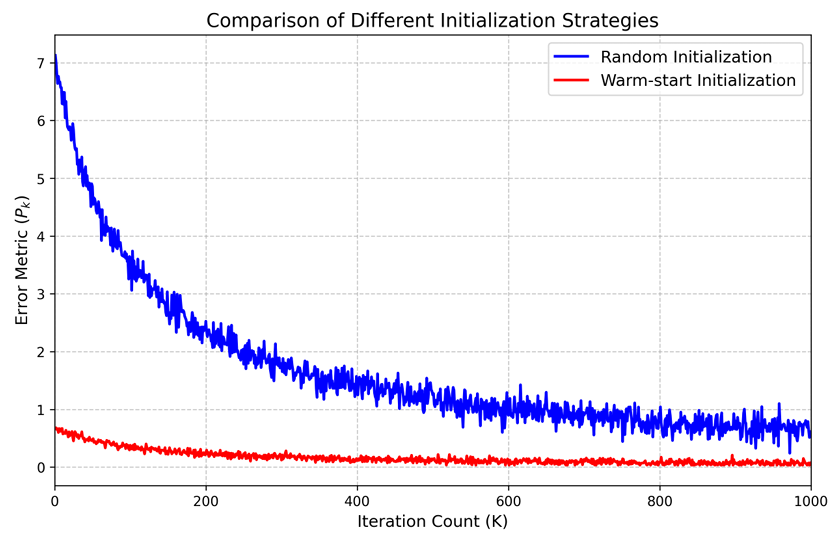

[On the Convergence of Nonconcave-Nonconvex Max-Min Optimization Problem](https://zhangxuelincode.github.io/)

**Xuelin Zhang***

**Journal of Numerical Simulations in Physics and Mathematics 2025 [J]**

- 本文针对非凸-非凹极大-极小优化问题，提出了一种基于双端Polyak-Łojasiewicz与二次增长条件的新分析框架，证明SAGDA算法以 O(1/K) 速率收敛，结果与凸-凹情形相当但要求更弱。

[13] ICML 2025 [ccf-A, Core A*]
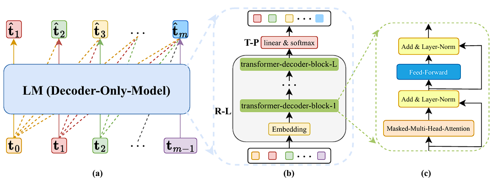

[On the Generalization Ability of Next-Token-Prediction Pretraining](https://icml.cc/media/icml-2025/Slides/44423.pdf)

Zhihao Li, [Xue Jiang](https://scholar.google.com/citations?hl=zh-CN&user=ajVvHgwAAAAJ), Liyuan Liu, **Xuelin Zhang**, Hong Chen and [Feng Zheng](https://scholar.google.com/citations?user=PcmyXHMAAAAJ&hl).

**International Conference on Machine Learning 2025 [C]**

- 大规模语言模型（LLMs）在自然语言处理任务中表现出色，但其预训练方法Next-Token-Prediction（NTP）的泛化能力缺乏理论分析。
- 建立了NTP预训练的精细泛化分析框架，提出了一种新颖的Rademacher复杂度分解方法，为基于DOMs的NTP预训练提供了理论保证，并通过实验验证了理论结论。
- 为理解NTP预训练的统计泛化性质提供了理论基础，有助于指导实际的模型训练和优化，推动了大规模语言模型理论研究的发展。

[12] ICDM 2024 [ccf-B, , Core A*]

[Generalized Sparse Additive Model with Unknown Link Function](https://ieeexplore.ieee.org/abstract/document/10884346)

[Peipei Yuan](https://www.researchgate.net/profile/Peipei-Yuan-3), [Xinge You*](https://scholar.google.com/citations?user=v7bRZX8AAAAJ&hl=en), [Hong Chen](https://chenhongml.github.io/), **Xuelin Zhang**, and [Qinmu Peng](https://scholar.google.com/citations?user=frL8yhIAAAAJ&hl=en). 

**IEEE International Conference on Data Mining 2024 [C]**

- 在这项工作中，我们提出了一种新型的广义加性模型，该模型具有一个通过双层方案自动学习的灵活链接函数.所提出的模型能够进行非线性逼近、隐藏交互和特征选择，同时也享有算法收敛的理论保证.
- 广义可加模型，就应该多考虑一个灵活的外层映射函数嘛！ 这不，我们就用双层建模学出来.

[11] ESWA 2024 [sci-1 Top]
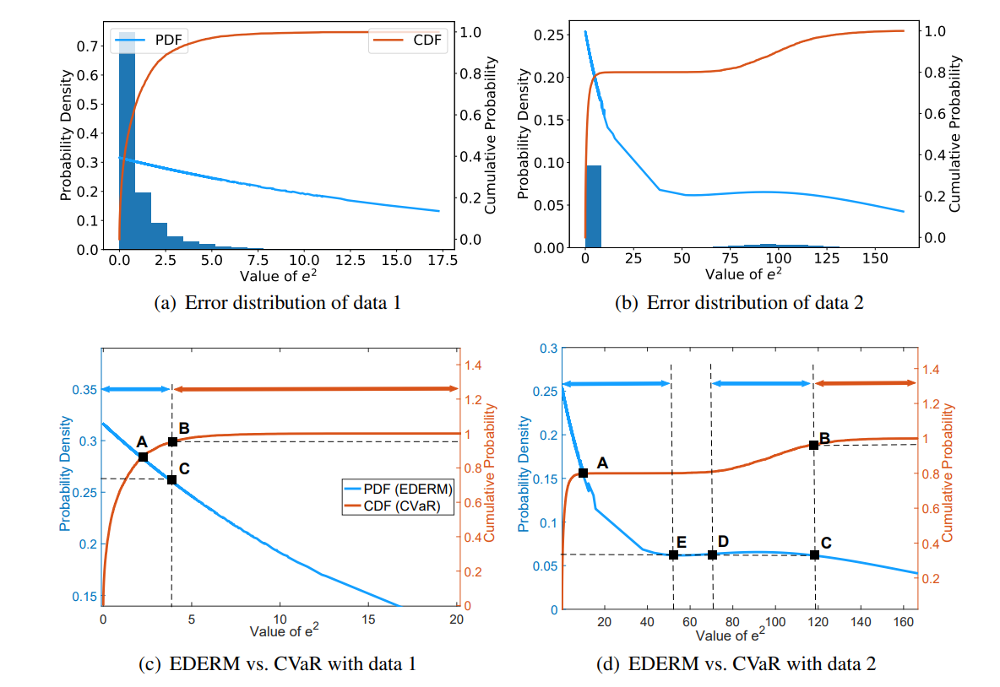

[Error Density-dependent Empirical Risk Minimization](https://www.sciencedirect.com/science/article/pii/S0957417424011989)

[Hong Chen*](https://chenhongml.github.io/), **Xuelin Zhang**, [Tieliang Gong](https://gong-tl.github.io/), [Bin Gu](https://scholar.google.com/citations?user=Vo8OgCgAAAAJ), [Feng Zheng](https://scholar.google.com/citations?user=PcmyXHMAAAAJ&hl=en). 

**Expert Systems With Applications 2024 [J]**

- 这篇论文缓解了依赖误差值的鲁棒学习准则的局限性，并提出了误差密度依赖的经验风险最小化框架，用于对抗异常数据的鲁棒回归与分类.我们的方法的有效性通过充分的实验评估得到了验证.
- 这个原创的损失经历了漫长的打磨，从2021年就一直在不断地从实验做补充.尽管花了三年的时间反复揉搓，仍觉得它还是个需要从理论上进行打磨的半成品.
- 有幸读到了[林华珍教授](https://csr.swufe.edu.cn/info/1131/1501.htm)发表在[**JASA'24**上的最新工作](https://www.tandfonline.com/doi/full/10.1080/01621459.2024.2412364)，在理论上给了一些新的启发，并且佐证了我们这一建模思路的合理性、科学性.
- 实现代码： [github.com/zhangxuelincode/EDERM](https://github.com/zhangxuelincode/EDERM)

[10] IJCAI 2024 [ccf-A, Core A*]
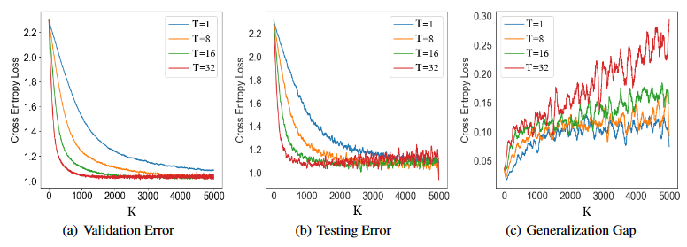

[Fine-grained Analysis of Stability and Generalization for Stochastic Bilevel Optimization](https://www.ijcai.org/proceedings/2024/609)

**Xuelin Zhang**, Hong Chen*, Bin Gu, Tieliang Gong, Feng Zheng. 

**International Joint Conference on Artificial Intelligence 2024 [C] (Oral)**

- 在这篇论文中，我们基于（平均参数）算法稳定性技术，对一阶基于梯度的双层优化方法进行了系统的泛化分析.
- 算法稳定性大法好，泛化分析中可以体现出优化的细节（迭代次数，算法设计，学习率，目标函数的光滑性/凸性等）.
- 实现代码：[github.com/zhangxuelincode/BilevelOptimization](https://github.com/zhangxuelincode/BilevelOptimization)

[9] IJCNN 2024 [ccf-C, Core A]
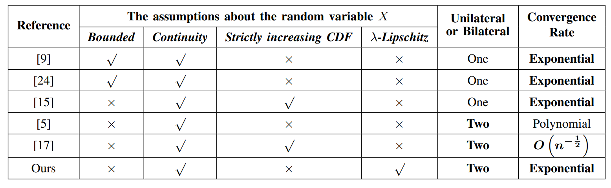

[Improved Concentration Bound for CVaR](https://ieeexplore.ieee.org/abstract/document/10650860)

[Peng Sima](https://www.semanticscholar.org/author/Peng-Sima/2320582518), [Hao Deng*](https://scholar.google.com/citations?user=94-PGUAAAAAJ&hl=en), **Xuelin Zhang**, Hong Chen. 

**International Joint Conference on Neural Networks 2024 [C]**

- 这篇论文介绍了一种新颖的估计器，该估计器依赖于风险价值（Value at Risk，简称VaR）的估计，并研究了在独立场景中的集中不等式，其中底层分布是次高斯（sub-Gaussian）、次指数（sub-exponential）或重尾（heavy-tailed）的.我们推导出的不等式是双边的，表现出指数衰减，并且不局限于有界场景.
- VaR和CVaR其实都是经济学里的常见度量，同时也在机器学习得到了广泛应用.这篇工作也是从复杂情景下，推导了无界目标的上下界.

[8] FCS 2023 [ccf-B]
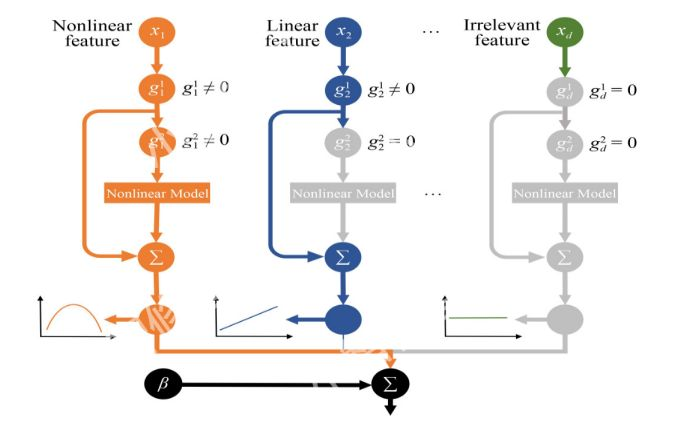

[Neural Partially Linear Additive Model](https://link.springer.com/article/10.1007/s11704-023-2662-3)

[Liangxuan Zhu](https://dl.acm.org/profile/99660968082), [Han Li*](https://www.researchgate.net/profile/Han-Li-115), **Xuelin Zhang**, [Lingjuan Wu](https://www.researchgate.net/profile/Lingjuan-Wu), Hong Chen. 

**Frontiers of Computer Science 2023 [J]**

- 这篇论文提出了一种神经部分线性加性模型，该模型能够在神经网络中自动区分不显著、线性和非线性特征，从而实现模型级别的可解释性.
- 神经可加模型很牛的！统计四大常客。  诺奖得主 Hinton 也做过这个方向 （[NeurIPS 2021](https://papers.nips.cc/paper/2021/hash/251bd0442dfcc53b5a761e050f8022b8-Abstract.html)）！ 

[7] AAAI 2023 [ccf-A, Core A*]
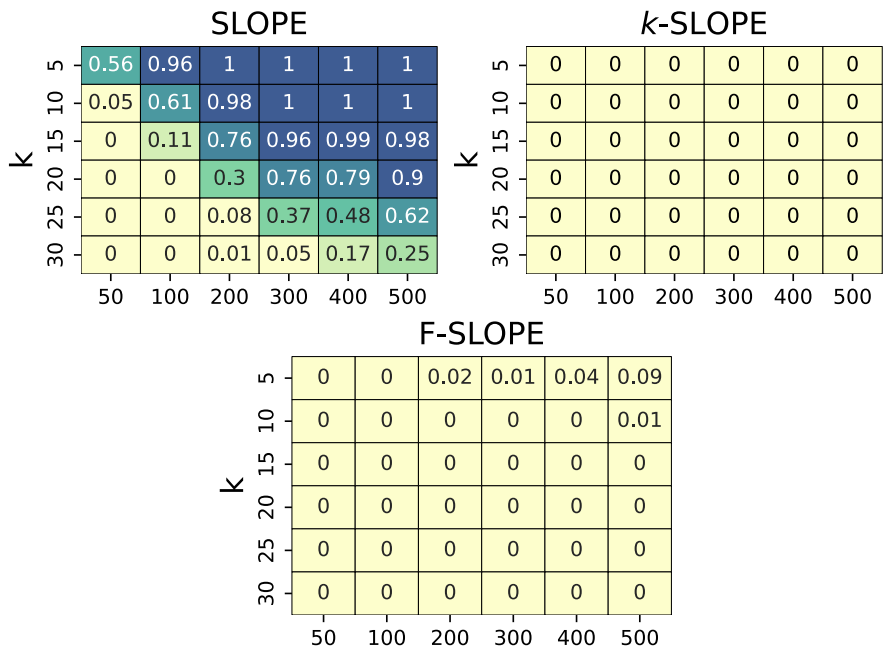

[Stepdown SLOPE for Controlled Feature Selection](https://ojs.aaai.org/index.php/AAAI/article/view/26050)

Jingxuan Liang, **Xuelin Zhang**, Hong Chen*, [Weifu Li](https://www.researchgate.net/profile/Weifu-Li), [Xin Tang](https://ieeexplore.ieee.org/author/37088421138). 

**Association for the Advancement of Artificial Intelligence 2023 [C] (Oral)**

- 这篇论文打破了以往对排序L-One惩罚估计（Sorted L-One Penalized Estimation，简称SLOPE）的局限，经典SLOPE仅限于控制假发现率（False Discovery Rate，简称FDR）.
- 论文考虑了基于逐步下降的SLOPE，以控制k个或更多假拒绝的概率（k-FWER）和假发现比例（False Discovery Proportion，简称FDP）.这就实现了特征选择任务中的错选率可控性质!
- 其实我们后来还考虑了group情境下的gSLOPE算法设计与理论保障.
- 实现代码： [github.com/zxlml/SLOPE](https://github.com/zxlml/SLOPE)

[6] APIN 2023 [sci-2]
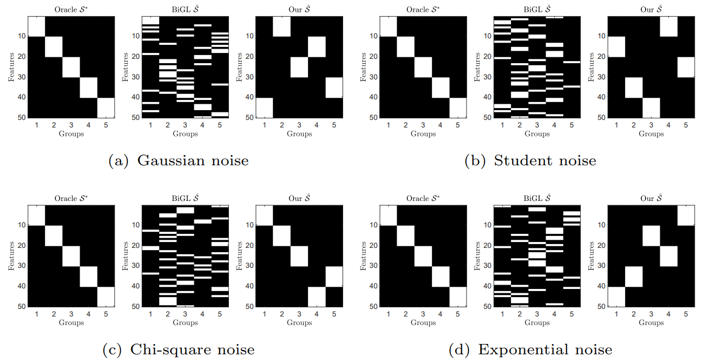

[Robust variable structure discovery based on tilted empirical risk minimization](https://dl.acm.org/doi/abs/10.1007/s10489-022-04409-z)

**Xuelin Zhang**, [Yingjie Wang](https://scholar.google.com/citations?user=jPJBUnoAAAAJ&hl=en), Liangxuan Zhu, Hong Chen, Han Li, Lingjuan Wu*. 

**Applied Intelligence 2023 [J]**

- 在这篇论文中，我们提出了一种新的基于收敛双层优化框架的鲁棒变量结构发现方法，用于基于组套索（group lasso），其中采用了鲁棒倾斜的经验风险最小化.
- 鲁棒性质是可以度量的喔，本文尝试分析了模型的击穿点,也就是能够忍受的最多的异常数据.
- 能够从高维数据中挖掘协同关系的组结构，挺有意思.不过做的有些粗糙，只考虑到了非重叠的分组结构.重叠情境比较复杂，这也是最近的考虑方向.
- 很高兴能够被[TERM损失的原团队在其最新的泛化工作中](https://arxiv.org/pdf/2409.19431)被关注到。
- 实现代码: [github.com/zhangxuelincode/demoTERMGL](https://github.com/zhangxuelincode/demoTERMGL)

[5] ICCCS 2022
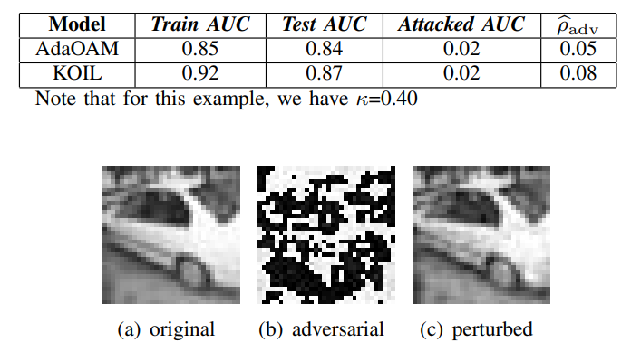

[Robustness of classifier to adversarial examples under imbalanced data](https://ieeexplore.ieee.org/document/9846074)

Wenqian Zhao, Han Li, Lingjuan Wu*, Liangxuan Zhu, **Xuelin Zhang**, [Yizhi Zhao](https://www.researchgate.net/profile/Yizhi-Zhao-2). 

**International Conference on Computer and Communication Systems 2022 [C]**

- 在这篇论文中，我们提供了一个理论框架，用于从AUC（ROC曲线下面积）的角度分析分类器对AE（Adversarial Examples，对抗性样本）在不平衡数据集下的鲁棒性，并推导出一个可解释的上限.

# 📝 硬件安全方向论文

[4] TCAD 2025 [ccf-A]
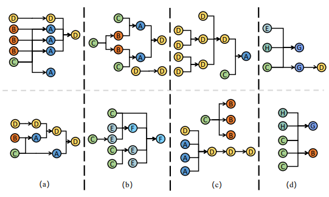

[Towards Precise and Explainable Hardware Trojan Localization at LUT Level](https://ieeexplore.ieee.org/document/10833822)

Hao Su, [Wei Hu](https://scholar.google.com.hk/citations?user=1kXI0YEAAAAJ&hl=en), **Xuelin Zhang**, [Dan Zhu](https://scholar.google.com/citations?user=vxiSH8kAAAAJ), Lingjuan Wu*. 

**IEEE Transactions on Computer-Aided Design of Integrated Circuits and Systems 2025 [J]**

- 提出的方法是旨在提取查找表（LUT）级别的丰富结构和行为特征，以训练一个可解释的图神经网络（GNN）模型，用于对FPGA网表中的设计节点进行分类，并识别感染木马的节点.
- 在跨年的这个夜晚，能够看到顶刊接收信息蛮开心的.希望2025年对我好一点 🙏 尤其是善良的编辑，领域主席和审稿人们.
- 实现代码: [github.com/zhangxuelincode/node_label](https://github.com/zhangxuelincode/node_label)

[3] ITC-Asia 2024 [ccf-C]
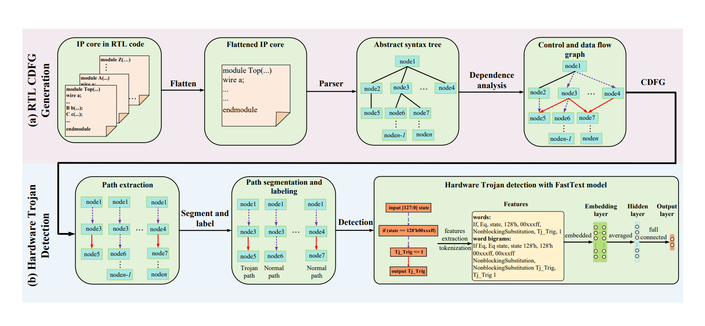

[Pinpointing Hardware Trojans Through Semantic Feature Extraction and Natural Language Processing](https://ieeexplore.ieee.org/abstract/document/10661348)

Yichen Li, Wei Hu, Hao Su, **Xuelin Zhang**, Yizhi Zhao, Lingjuan Wu*. 

**International Test Conference in Asia 2024 [C]**

- 在这项工作中，我们提出了一种新颖的RTL（寄存器传输级）硬件木马检测方法.我们的方法涉及将硬件设计转换为CDFG（控制数据流图），然后进行路径提取和分割.
- 这篇工作算是NLP技术在硬件木马检测任务上，比较早的应用.我们首次在RTL仿真阶段对代码直接进行建模，就可以高精度地检测出木马设计，无需进一步仿真或者流片.

[2] ICCAD 2023 [ccf-B, Core A]
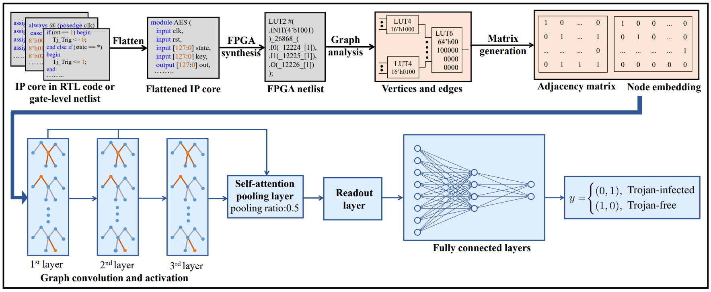

[Automated Hardware Trojan Detection at LUT Using Explainable Graph Neural Networks](https://ieeexplore.ieee.org/document/10323915)

Lingjuan Wu, Hao Su, **Xuelin Zhang**, [Yu Tai](https://ieeexplore.ieee.org/author/37086110235), Han Li, Wei Hu*. 

**International Conference on Computer-Aided Design 2023 [C]**

- 在这项工作中，我们提出了一种基于图神经网络（GNNs）的新型硬件木马检测方法，针对FPGA网表.我们利用LUT级别的丰富显式结构特征和行为特征，这为木马检测提供了一个理想的抽象层次和粒度.通过训练一个优化的类别平衡焦点损失的GNN模型，实现了自动化的木马特征提取和分类.
- 我们引入了一些很有意思的（基于格兰杰因果思想）可解释策略以及处理非均衡问题的策略，这也是我们初步尝试GNN的应用.
- 实现代码：[github.com/zxlml/XGNN_HT_Detection](https://github.com/zxlml/XGNN_HT_Detection)

[1] HOST 2022
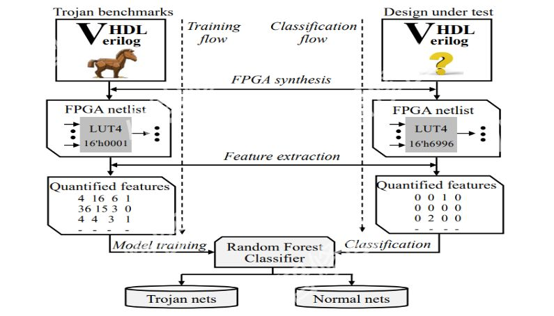

[Hardware Trojan Detection at LUT: Where Structural Features Meet Behavioral Characteristics](https://ieeexplore.ieee.org/document/9840276)

Lingjuan Wu, **Xuelin Zhang**, [Siyi Wang](https://scholar.google.com/citations?user=xZ6Hd2IAAAAJ), Wei Hu. 

**International Symposium on Hardware Oriented Security and Trust 2022 [C]**

- 这项工作提出了一种新颖的硬件木马检测方法，该方法利用现场可编程门阵列（FPGA）网表中的静态结构特征和行为特征.将硬件设计源映射到查找表（LUT）网络使得这些特征变得明确，允许通过机器学习自动化特征提取，并进一步有效地检测木马.
- 这篇论文我们引入了混合高效重采样（过采样与欠采样结合）来处理非均衡问题，并在实验中得到了理想的性能提升.
- 😞 遗憾的是，尽管HOST会议在这个领域有着一定的知名度，但是ccf-C都没进.
- 实现代码：[github.com/zxlml/HOST22](https://github.com/zxlml/HOST22)

# 📝   在投/审稿中工作

**（1）一作**

- Bilevel Manifold Fitting.
- Maximum Likelihood Neural Additive Models.
- Meta Additive Model: Learning Theory Analysis and Applications.
- [UltraHorizon: Benchmarking Agent Capabilities in Ultra Long-Horizon Scenarios.](https://arxiv.org/pdf/2509.21766)
- On the Stability and Generalization of First-order Bilevel Minimax Optimization.
- S2MAM: Semi-supervised Meta Additive Model for Robust Estimation and Variable Selection. 
- Beyond False Discovery Rate: A Stepdown Group SLOPE Approach for Grouped Variable Selection.
- Distribution-Aware Neural Additive Models: Robust Interpretable Deep Learning with Feature Selection.

**（2）合作**

- BIAM: Bilevel Interactive Additive Model.
- Detecting LLM Hallucinations via Nonlinear Manifold Separation.
- Explainable Hardware Trojan Detection and Localization in FPGA Netlists.
- Fine-grained Analysis on the Generalization of Multimodal Metric Learning.
- [D-Artemis: A Deliberative Cognitive Framework for Mobile GUI Multi-Agents.](https://arxiv.org/pdf/2509.21799)
- Robust Hardware Trojan Detection at RTL through Adversarial Attack and Defense.
- From Conflicts to Convergence: A Zeroth-order Method for Multi-Objective Learning.
- Enhancing Trojan Detection Robustness: A Pseudo-Supervised Framework with Imbalance-Aware Robust Loss.
- **+_+**  More ongoing works on LLM agents and intelligent bioinformatics are coming soon!

# 🎖️ 以往活动与奖项
- *2025.7 - 2025.12:*  交流实习 [**北京滴滴 AI LAB: L-Lab**](https://www.didiglobal.com/science/ailabs).
- *2025.12:* 现场汇报： 安徽合肥召开的[**31th IEEE International Conference on Parallel and Distributed Systems 2025**](http://ieee-icpads.org.cn/).
- *2025.11:* 现场汇报： 韩国首尔召开的[**34th ACM Conference on Information and Knowledge Management 2025**](https://cikm2025.org/).
- *2025.11*: 荣获 [华中农业大学**研究生年会（数学）一等奖**](https://mp.weixin.qq.com/s/g6Lh_Vp07kt1QMgahd7i2g).
- *2025.10*: 荣获“**2025年度三好研究生**”.
- *2025.8:*  参会 北京海淀清华大学召开的 [**数学发展述评暨中青年学术研讨会**](https://ymsc.tsinghua.edu.cn/info/1060/4437.htm).
- *2025.8:*  参会 北京海淀北京大学召开的 [**中国机器学习与科学应用大会**](https://cmlr.pku.edu.cn/Events/Conference/6ace3fc8bfeb40dd835b577de6e90cce.htm).
- *2025.5:*  参会 湖北武汉召开的[**第三届机器学习与统计学会议**](https://ml-stat.github.io/MLSTAT2025/).
- *2025.5:*  获选 华中农业大学第二十次**研究生代表大会信息学院2022级代表（1人）**.
- *2025.4:*  参会 湖北武汉召开的[**2025机器学习数学理论与智慧农业应用研讨会暨CSIAM青年论坛**](https://news.hzau.edu.cn/info/1011/34888.htm).
- *2025.4:*  荣获 [2024年度**湖北省工业与应用数学学会优秀研究生论文二等奖**](https://aisle.hzau.edu.cn/info/1097/2476.htm).
- *2025.4:*  现场汇报： 湖北荆门召开的[**湖北省工业与应用数学学会2025年学术交流大会**](https://aisle.hzau.edu.cn/info/1097/2476.htm).
- *2025.3:*  荣获 2025年度党支部**优秀党员**.
- *2024.12:* 现场汇报： [**2024年湖北省工业与应用数学学会优秀研究生论文评选**.](http://hbsiam.whu.edu.cn/a/tongzhigonggao/86.html)
- *2024.12:* 现场汇报： [**CCF武汉2024年会暨第八届优秀博士生学术风采展示论坛**.](https://www.ccf.org.cn/Chapters/Chapters/Wuhan/hyhdzxdt/2024-12-23/836269.shtml)
- *2024.11:* 荣获 [2024年度**博士国家奖学金**.](https://aisle.hzau.edu.cn/info/1097/2216.htm)
- *2024.11:* 荣获 [2024年度**三好研究生**.](https://yjs.hzau.edu.cn/info/1192/10321.htm)
- *2024.11:* 海报参展： 江苏南京召开的[**第二十二届中国工业与应用数学学会年会**.](https://aisle.hzau.edu.cn/info/1097/2201.htm)
- *2024.8:*  现场汇报： 韩国济州岛召开的[**IJCAI-2024国际人工智能会议口头汇报与海报展示**.](https://aisle.hzau.edu.cn/info/1097/1911.htm)
- *2024.5 - 2025.1:* 前往[**中山大学深圳校区-沈力教授团队交流学习**](https://scst.sysu.edu.cn/members/members01/1415116.htm).
- *2024.5:*  荣获 2024年度党支部**优秀党员**.
- *2024.4:*  现场汇报： 湖北荆州召开的[**湖北省工业与应用数学学会2024年学术交流大会**](https://aisle.hzau.edu.cn/info/1097/1901.htm)[**及颁奖仪式**.](http://hbsiam.whu.edu.cn/a/shouyehuandeng/85.html)
- *2023.11:* 荣获 **华中农业大学信息学院“电子信息研究生论坛”一等奖**.
- *2023.8:*  参会 浙江杭州召开的[**数据科学前沿国际研讨会**.](http://cds.zju.edu.cn/a/hyyg/3142.html)
- *2023.7:*  录取 **武汉大学国家天元数学中部中心[《高性能计算短期课程》.](https://tmcc.whu.edu.cn/info/1051/1571.htm)**
- *2023.7:*  参会 贵州贵阳召开的[**第四届全国大数据与人工智能科学大会**.](http://bda.pku.edu.cn/info/1003/2402.htm)
- *2023.3:*  参会 海南海口召开的[**第十一届全国空间环境及其应用专题研讨会**.](http://www.nssc.cas.cn/library/cyzy/rese/202304/t20230420_6742010.html)
- *2022.5:*  获选 [华中农业大学第十七次**研究生代表大会信息学院2020级代表（1人）**.](https://coi.hzau.edu.cn/info/1027/9450.htm)
- *2022.3:*  担任 2021年秋季学期本科生课程《数字逻辑与EDA技术》助教.
- *2021.9:*  担任 2021年秋季学期本科生课程《嵌入式系统》助教，并获评[**“课程思政”示范建设项目**.](https://coi.hzau.edu.cn/info/1015/9076.htm)
- *2021.3:*  担任 2021年春季学期本科生课程《C++高级程序设计实验》助教.
- *2017.8:*  担任 中国农业大学“新丝路暑期实践支队”的微信公众号负责人，历史回顾 [**1-启程**](https://mp.weixin.qq.com/s/Xt4DKLweN3KdBmz-v9CSFA), [**2-征程**](https://mp.weixin.qq.com/s/XePZcWS8f5cHk0K4J41HyQ), [**3-马尾区**](https://mp.weixin.qq.com/s/P3YMbiHi9Pk3ZmN3f-JpyQ), [**4-吐槽**](https://mp.weixin.qq.com/s/cDJHORkRZJoFeH4KhkMDBA), [**5-船政文化**](https://mp.weixin.qq.com/s/qZO5UI575KtJBSf6yhQbdg), [**6-泉州瓷都**](https://mp.weixin.qq.com/s/d4baOjG0Cc8_jD_wT6h3oA?token=1582253406&lang=zh_CN), [**7-塔兜村**](https://mp.weixin.qq.com/s/jPcF2tUUb3Y76YPHAhrqOA), [**8-塔兜村日记**](https://mp.weixin.qq.com/s/wIKUMpG9MZWazOs0Uo-JdA), [**9-征途尾音**](https://mp.weixin.qq.com/s/nMPc2UpQv53b1jDIK2b_0Q).
- *2017.4:*  担任 [北京国际长跑节-春季半马志愿者](http://ciee.cau.edu.cn/art/2017/5/10/art_26711_514437.html).

# 🛠️ 专利

- *2024.06:*  [**一种混凝土抗压能力预测方法、装置、设备及存储介质(已授权)**](https://patents.google.com/patent/CN114580299A/zh).
- *2025.07:*  **一种基于对抗训练的鲁棒硬件木马检测模型生成方法(已受理)**.
- *2024.06:*  **一种基于FPGA网表特征子图的硬件木马检测方法(实质审查中)**.
- *2024.10:*  **一种基于语义特征自动提取的硬件木马检测方法(实质审查中)**.
- *2023.01:*  **一种基于图神经网络的硬件木马自动检测方法(实质审查中)**.

# 👾 软著

- *2025.7:*  **流形学习视频优化处理软件 V1.0 （已授权）**.
- *2025.11:*  **移动GUI大模型智能体系统 （实质审查中）**.
- *2025.11:*  **基于双层广义可加模型的小麦病害诊断系统 （实质审查中）**.
- *2025.11:*  **基于双层时序图神经网络的电力能源需求与负荷预测软件 （实质审查中）**.

# 💬 学术服务

- *会议审稿人:* [ICLR](https://iclr.cc/), [ICML](https://icml.cc/), [NeurIPS](https://neurips.cc/), [CVPR](https://cvpr.thecvf.com/Conferences/2026), [AAAI](https://aaai.org/conference/aaai/aaai-26/), [AISTAT](https://virtual.aistats.org/), [IJCNN](https://2025.ijcnn.org/), [ACML](https://www.acml-conf.org/).

- *期刊审稿人:* [Artificial Intelligence](https://www.sciencedirect.com/journal/artificial-intelligence), [Machine Learning](https://link.springer.com/journal/10994), [Expert Systems With Applications](https://www.sciencedirect.com/journal/expert-systems-with-applications), [Statistics and Computing](https://link.springer.com/journal/11222), [Discover Analytics](https://link.springer.com/journal/44257), [International Journal of Applied and Computational Mathematics](https://link.springer.com/journal/40819), [International Journal of Data Science and Analytics](https://link.springer.com/journal/41060), [Journal of Infrastructure, Policy and Development](https://systems.enpress-publisher.com/index.php/jipd), [Molecular & Cellular Biomechanics](https://www.techscience.com/journal/mcb) .

# 🌏 浏览记录

